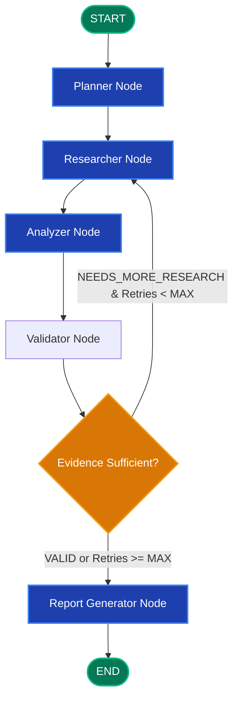

# LangGraph Research Dashboard (LRD)

[](https://github.com/langchain-ai/langgraph)
[](https://fastapi.tiangolo.com)
[](https://react.dev)
[](https://www.typescriptlang.org)
[](https://www.postgresql.org)
[](https://opensource.org/licenses/MIT)

> **LangGraph Research Dashboard (LRD)** is a production-grade autonomous research platform. It breaks down complex research questions into structured subtasks, retrieves verifiable real-time web intelligence, analyzes and critiques findings for contradictions and gaps, conditionally refines searches, and generates comprehensive, cited research reports.

---

## 1. Executive Product Overview

In modern knowledge work, answering complex inquiries requires synthesizing multiple perspectives, identifying discrepancies across sources, and actively seeking out missing information. Standard LLM chatbots fail at this because they operate as **stateless, single-turn text generators** prone to hallucination, shallow retrieval, and blind sequential generation.

**LangGraph Research Dashboard** replaces linear generation with an **agentic, stateful, cyclical graph workflow**:
- **Structured Planning**: Automatically decomposes multifaceted questions into atomic, testable research subtasks.
- **Pluggable Web Retrieval**: Gathers factual web data via dedicated search tools (Tavily Search API) and extracts primary source content.
- **Critical Cross-Analysis**: Cross-examines collected evidence to detect agreements, disagreements, and empirical contradictions.
- **Self-Critiquing Validation**: A dedicated validator node evaluates evidence sufficiency and dynamically loops back if information gaps remain.
- **Interactive Visualization**: Real-time visual representation of the active graph state, live node transitions, and source discovery.
- **Enterprise Persistence**: Backed by PostgreSQL 16, pgvector, and LangGraph checkpointer for thread resumption and auditability.

---

## 2. Core LangGraph Workflow



---

## 3. Technology Stack

| Layer | Technologies | Justification |
|---|---|---|
| **AI Orchestration** | **LangGraph**, **LangChain** | First-class cyclical graphs, conditional branching, state reducers, checkpointing |
| **LLM Interface** | **OpenAI / Anthropic Compatible** | Abstracted behind `BaseChatModel` for zero vendor lock-in |
| **Search Engine** | **Tavily Search API** | Optimized for autonomous agents; provides clean extracts and relevance ranking |
| **Backend API** | **FastAPI**, **Pydantic v2**, **Uvicorn** | High-performance async I/O, automatic OpenAPI 3.1 docs, native SSE streaming |
| **Database** | **PostgreSQL 16**, **pgvector** | Unified relational operational store, LangGraph checkpoints, and vector embeddings |
| **ORM / Migration**| **SQLAlchemy 2.0 (asyncio)**, **Alembic** | Type-safe asynchronous DB interactions and managed migrations |
| **Frontend** | **React 18**, **TypeScript**, **Vite** | Modern single-page dashboard with fast HMR and strict typing |
| **Styling** | **Tailwind CSS** | Clean, responsive, SaaS-grade UI components |
| **State Management**| **TanStack Query (React Query)** | Robust server-state caching, background revalidation, and pagination |
| **Containerization**| **Docker**, **Docker Compose** | Reproducible multi-service deployment |
| **Testing** | **Pytest** (Backend), **Vitest** (Frontend) | Unit, graph routing, API, and UI component testing |

---

## 4. Directory Structure

```
langgraph-research-dashboard/
│
├── README.md                          # Comprehensive project overview and architecture
├── docker-compose.yml                 # Local PostgreSQL 16 + pgvector environment
├── .env.example                       # Documented environment configuration template
├── .gitignore                         # Python, Node, environment, and system exclusions
│
├── docs/                              # Deep engineering specifications
│   ├── architecture.md                # System layers, component diagrams, boundaries
│   ├── workflow.md                    # LangGraph state design, node specs, conditional logic
│   ├── database.md                    # PostgreSQL schema, ER diagram, pgvector indices
│   ├── api.md                         # REST API endpoints, schemas, SSE protocols
│   ├── technology-decisions.md        # Architecture Decision Records (ADRs)
│   ├── roadmap.md                     # 12-phase development plan & acceptance criteria
│   └── implementation_plan.md         # Granular implementation blueprint (Phases 1-11)
│
├── backend/                           # Asynchronous FastAPI service
│   ├── app/
│   │   ├── api/                       # REST endpoints & SSE route handlers
│   │   ├── agents/                    # High-level agent orchestration
│   │   ├── graph/                     # LangGraph StateGraph assembly & conditional routing
│   │   ├── nodes/                     # Discrete LangGraph node implementations
│   │   ├── tools/                     # Web search, scraper, and retriever interfaces
│   │   ├── services/                  # Business logic & background workers
│   │   ├── models/                    # SQLAlchemy 2.0 database models
│   │   ├── schemas/                   # Pydantic v2 schemas for requests & state
│   │   ├── database/                  # Engine setup, session factories, Alembic migrations
│   │   ├── config/                    # Pydantic Settings & environment loaders
│   │   └── main.py                    # FastAPI application entrypoint
│   └── tests/                         # Pytest unit, graph, and API test suites
│
├── frontend/                          # React + TypeScript + Vite SPA
│   └── src/
│       ├── components/                # Reusable UI primitives (Buttons, Modals, Badges)
│       ├── pages/                     # Main views (Dashboard, NewResearch, SessionView)
│       ├── services/                  # Axios / Fetch client and SSE listeners
│       ├── hooks/                     # Custom React hooks (useResearchStream, useSession)
│       ├── types/                     # Shared TypeScript interfaces mirroring backend
│       ├── layouts/                   # Dashboard shell, navigation sidebar, header
│       └── features/                  # Feature slices (GraphVisualizer, ReportViewer)
│
└── scripts/                           # Database seeders, test runners, and dev utilities
```

---

## 5. Development Roadmap Summary

- **Phase 0: Product & Architecture Planning** *(Completed)*: Technical specifications, schemas, ADRs, scaffolding.
- **Phase 1: LangGraph Foundation** *(Completed)*: Core state machine, Planner, Researcher (mocked), Analyzer, Report node, unit tests.
- **Phase 2: Real Web Research**: Tavily search provider, URL deduplication, real source extraction.
- **Phase 3: Conditional Agent**: Validator node, conditional looping, retry limits, loop circuit breakers.
- **Phase 4: FastAPI Backend**: REST API endpoints, OpenAPI documentation, asynchronous task workers.
- **Phase 5: PostgreSQL Persistence**: SQLAlchemy models, Alembic migrations, session/source persistence.
- **Phase 6: React Dashboard**: SaaS-grade research interface, graph visualization, markdown reports.
- **Phase 7: Real-Time Streaming**: Server-Sent Events (SSE), live node transitions, real-time citation feed.
- **Phase 8: Checkpointing & Memory**: PostgresSaver checkpointer, workflow resumption, time travel.
- **Phase 9: RAG Integration**: PDF ingestion, pgvector embeddings, hybrid web/document research.
- **Phase 10: Human-in-the-Loop**: Interactive plan approval, editing, and workflow interruption.
- **Phase 11: Production Hardening**: Authentication, rate limiting, structured logging, CI/CD, production Docker.

---

## 6. Quickstart (Development Setup)

### Prerequisites
- Python 3.11+
- Node.js 20+ & npm
- Docker & Docker Compose

### 1. Configure Environment
```bash
cp .env.example .env
# Edit .env with your OPENAI_API_KEY and TAVILY_API_KEY
```

### 2. Launch Local Database (PostgreSQL + pgvector)
```bash
docker compose up -d postgres
```

### 3. Backend Setup (Virtual Environment)
```bash
cd backend
python -m venv .venv
source .venv/bin/activate  # On Windows: .venv\Scripts\activate
pip install -r requirements.txt  # Ready in Phase 1
uvicorn app.main:app --reload --port 8000
```

### 4. Frontend Setup
```bash
cd frontend
npm install
npm run dev
```

---

## 7. LangGraph Educational Reference

This project serves as a reference architecture for real-world LangGraph patterns:
- **State**: Centralized, immutable or additive dictionary defining all data flowing across steps.
- **Nodes**: Pure, testable functions transforming state.
- **Edges**: Deterministic paths guiding execution flow.
- **Conditional Edges**: Dynamic routers that inspect state (e.g. validator assessment) to branch or loop.
- **Reducers**: Annotations (`operator.add`) enabling safe aggregation of evidence across iterative loops.
- **Checkpointers**: Transactional persistence layer recording graph state snapshots at every step.
