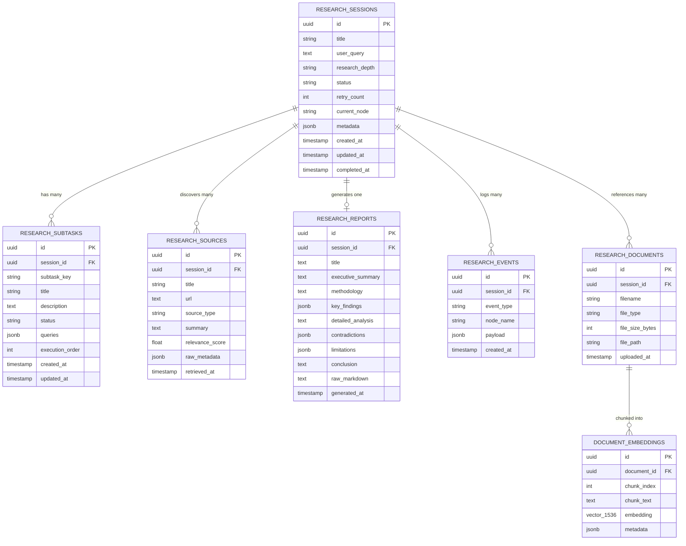

# Database Design & Entity Relationship Specification

## 1. Overview

The storage architecture of the LangGraph Research Dashboard uses **PostgreSQL 16** with the **pgvector** extension. The database serves two primary roles:
1. **Relational Operational Data Store (ODS)**: Tracking research sessions, subtasks, web sources, generated reports, and granular event logs.
2. **LangGraph Checkpoint & Vector Store**: Storing serializable graph state snapshots for workflow resumption and semantic chunk embeddings for document RAG.

---

## 2. Entity Relationship (ER) Diagram



---

## 3. Normalized Relational Tables

### 3.1 `research_sessions`
Represents an individual user-initiated research task.
- `id`: `UUID` (Primary Key, `gen_random_uuid()`)
- `title`: `VARCHAR(255)` — Auto-generated summary title
- `user_query`: `TEXT` NOT NULL — Raw prompt provided by the user
- `research_depth`: `VARCHAR(32)` NOT NULL DEFAULT 'standard' — ('quick', 'standard', 'deep')
- `status`: `VARCHAR(32)` NOT NULL DEFAULT 'pending' — ('pending', 'running', 'completed', 'failed', 'cancelled')
- `retry_count`: `INTEGER` NOT NULL DEFAULT 0 — Number of validation loops executed
- `current_node`: `VARCHAR(64)` — ('planner', 'researcher', 'analyzer', 'validator', 'report_generator')
- `metadata`: `JSONB` — Extensible configuration (model overrides, tags)
- `created_at`: `TIMESTAMPTZ` NOT NULL DEFAULT `NOW()`
- `updated_at`: `TIMESTAMPTZ` NOT NULL DEFAULT `NOW()`
- `completed_at`: `TIMESTAMPTZ` NULL

**Indexes**:
- `idx_sessions_status` ON `research_sessions(status)`
- `idx_sessions_created_at` ON `research_sessions(created_at DESC)`

---

### 3.2 `research_subtasks`
Stores the subtasks generated by the Planner node.
- `id`: `UUID` (Primary Key, `gen_random_uuid()`)
- `session_id`: `UUID` NOT NULL REFERENCES `research_sessions(id)` ON DELETE CASCADE
- `subtask_key`: `VARCHAR(64)` NOT NULL — e.g. `subtask_1`
- `title`: `VARCHAR(255)` NOT NULL
- `description`: `TEXT` NOT NULL
- `status`: `VARCHAR(32)` NOT NULL DEFAULT 'pending'
- `queries`: `JSONB` NOT NULL DEFAULT '[]'::jsonb — Target search queries
- `execution_order`: `INTEGER` NOT NULL DEFAULT 0
- `created_at`: `TIMESTAMPTZ` NOT NULL DEFAULT `NOW()`
- `updated_at`: `TIMESTAMPTZ` NOT NULL DEFAULT `NOW()`

**Indexes**:
- `idx_subtasks_session_id` ON `research_subtasks(session_id)`

---

### 3.3 `research_sources`
Catalog of all distinct digital sources retrieved by search tools.
- `id`: `UUID` (Primary Key, `gen_random_uuid()`)
- `session_id`: `UUID` NOT NULL REFERENCES `research_sessions(id)` ON DELETE CASCADE
- `title`: `VARCHAR(512)` NOT NULL
- `url`: `TEXT` NOT NULL
- `source_type`: `VARCHAR(32)` NOT NULL DEFAULT 'web' — ('web', 'academic', 'document')
- `summary`: `TEXT` NOT NULL
- `relevance_score`: `REAL` NOT NULL DEFAULT 0.0
- `raw_metadata`: `JSONB` DEFAULT '{}'::jsonb — Search score, publish date, author
- `retrieved_at`: `TIMESTAMPTZ` NOT NULL DEFAULT `NOW()`

**Indexes**:
- `idx_sources_session_id` ON `research_sources(session_id)`
- `idx_sources_url` ON `research_sources(url)`

---

### 3.4 `research_reports`
The final synthesized research artifact.
- `id`: `UUID` (Primary Key, `gen_random_uuid()`)
- `session_id`: `UUID` NOT NULL UNIQUE REFERENCES `research_sessions(id)` ON DELETE CASCADE
- `title`: `VARCHAR(512)` NOT NULL
- `executive_summary`: `TEXT` NOT NULL
- `methodology`: `TEXT` NOT NULL
- `key_findings`: `JSONB` NOT NULL DEFAULT '[]'::jsonb
- `detailed_analysis`: `TEXT` NOT NULL
- `contradictions`: `JSONB` NOT NULL DEFAULT '[]'::jsonb
- `limitations`: `JSONB` NOT NULL DEFAULT '[]'::jsonb
- `conclusion`: `TEXT` NOT NULL
- `raw_markdown`: `TEXT` NOT NULL
- `generated_at`: `TIMESTAMPTZ` NOT NULL DEFAULT `NOW()`

---

### 3.5 `research_events`
Audit trail and real-time streaming timeline.
- `id`: `UUID` (Primary Key, `gen_random_uuid()`)
- `session_id`: `UUID` NOT NULL REFERENCES `research_sessions(id)` ON DELETE CASCADE
- `event_type`: `VARCHAR(64)` NOT NULL — ('node_started', 'node_completed', 'source_discovered', 'retry_triggered')
- `node_name`: `VARCHAR(64)` NOT NULL
- `payload`: `JSONB` NOT NULL DEFAULT '{}'::jsonb
- `created_at`: `TIMESTAMPTZ` NOT NULL DEFAULT `NOW()`

**Indexes**:
- `idx_events_session_created` ON `research_events(session_id, created_at ASC)`

---

### 3.6 `research_documents` & `document_embeddings` (Phase 9 RAG Preparation)
- `research_documents`: Tracks uploaded PDFs/DOCX files.
- `document_embeddings`: Stores chunk text alongside 1536-dimensional OpenAI `vector(1536)` (or 768-d for open weights).
- **Index**: HNSW index for cosine distance similarity searches:
  ```sql
  CREATE INDEX idx_embeddings_cosine ON document_embeddings USING hnsw (embedding vector_cosine_ops);
  ```

---

## 4. Migration Strategy
Migrations are managed via **Alembic**.
- Reversible upgrade/downgrade scripts.
- Asynchronous database drivers (`asyncpg`) for non-blocking I/O in FastAPI.
- All timestamps use UTC (`TIMESTAMPTZ`).
