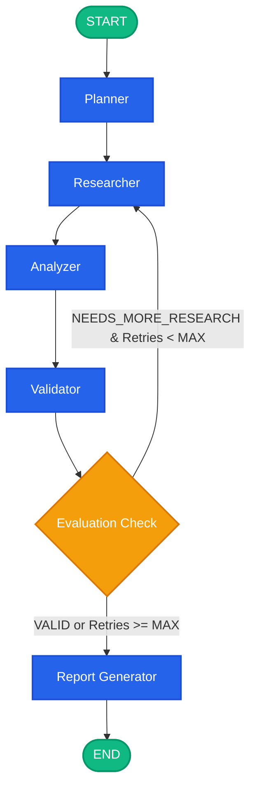

# LangGraph Workflow Specification

## 1. Overview of the Graph Topology

The research process is modeled as an explicit state machine with cyclical feedback capabilities. Rather than executing a blind sequential chain, the system evaluates findings iteratively and loops back when information gaps or contradictions emerge.



---

## 2. Strongly Typed Research State

The state is managed using Python `typing.TypedDict` and Pydantic validation schemas. Each node receives the current `ResearchState` dictionary and returns a partial state update dictionary.

```python
from typing import TypedDict, List, Optional, Dict, Any, Annotated
import operator
from pydantic import BaseModel, Field

class Subtask(BaseModel):
    id: str = Field(description="Unique subtask identifier, e.g. subtask_1")
    title: str = Field(description="Actionable title of the subtask")
    description: str = Field(description="Detailed scope of the research objective")
    status: str = Field(default="pending", description="pending | in_progress | completed | failed")
    queries: List[str] = Field(default_factory=list, description="Targeted search queries for this subtask")

class CollectedSource(BaseModel):
    id: str = Field(description="UUID or hash of the URL")
    title: str = Field(description="Title of the web source or document")
    url: str = Field(description="Absolute URL of the source")
    source_type: str = Field(default="web", description="web | academic | document | news")
    summary: str = Field(description="Extracted key information relevant to the research query")
    relevance_score: float = Field(default=0.0, description="Estimated relevance between 0.0 and 1.0")
    retrieved_at: str = Field(description="ISO timestamp of when the content was fetched")

class ValidationResult(BaseModel):
    status: str = Field(description="VALID | NEEDS_MORE_RESEARCH | FAILED")
    reason: str = Field(description="Detailed rationale from the validator LLM")
    needs_more_research: bool = Field(default=False)
    missing_aspects: List[str] = Field(default_factory=list, description="Specific gaps detected")
    suggested_queries: List[str] = Field(default_factory=list, description="Follow-up queries to fill gaps")

class FinalReport(BaseModel):
    title: str
    executive_summary: str
    methodology: str
    key_findings: List[str]
    detailed_analysis: str
    contradictions: List[str]
    limitations: List[str]
    conclusion: str
    sources_cited: List[str]

class ResearchState(TypedDict):
    # Session Identifiers
    research_id: str
    user_query: str
    research_depth: str                       # 'quick' | 'standard' | 'deep'
    
    # Planning & Decomposition
    research_objective: str
    subtasks: List[Dict[str, Any]]
    current_subtask_index: int
    
    # Research & Evidence Collection (Uses additive reducer to merge findings)
    collected_sources: Annotated[List[Dict[str, Any]], operator.add]
    research_notes: Annotated[List[str], operator.add]
    
    # Synthesis & Validation
    analysis: Optional[Dict[str, Any]]
    validation_result: Optional[Dict[str, Any]]
    
    # Retry and Flow Control
    retry_count: int
    max_retries: int
    execution_status: str                     # 'planning' | 'researching' | 'analyzing' | 'validating' | 'completed' | 'failed'
    current_node: str
    errors: Annotated[List[str], operator.add]
    
    # Output
    final_report: Optional[Dict[str, Any]]
```

### Explanation of State Fields
- `research_id`: Uniquely correlates database records, SSE streaming events, and LangGraph checkpoint threads.
- `subtasks`: Structured decomposition produced by Planner Node.
- `collected_sources`: Annotated with `operator.add` reducer so that repeated iterations or parallel workers append new citations without overwriting prior evidence.
- `validation_result`: Stores the critique, gaps, and suggested search phrases for refinement loops.
- `retry_count`: Incremented when `Validator` routes back to `Researcher`. Prevents infinite loops.
- `errors`: Collects non-fatal warnings or tool timeouts so the final report can accurately reflect limitations.

---

## 3. Node Specifications

### 3.1 Planner Node
- **Inputs**: `user_query`, `research_depth`
- **Responsibilities**:
  1. Parse the ambiguous or broad user prompt.
  2. Synthesize an explicit, testable `research_objective`.
  3. Decompose into 2-5 distinct `Subtask` items.
  4. Generate 2-3 precise search queries per subtask tailored for search APIs.
- **Output Partial State**:
  ```python
  {
      "research_objective": str,
      "subtasks": [Subtask, ...],
      "current_subtask_index": 0,
      "current_node": "planner",
      "execution_status": "researching"
  }
  ```

### 3.2 Researcher Node
- **Inputs**: `subtasks`, `collected_sources`, `validation_result` (if looping back), `retry_count`
- **Responsibilities**:
  1. Determine target queries: executes pending subtask queries, or executes `suggested_queries` if repeating after validator feedback.
  2. Invoke `SearchToolInterface` (e.g. Tavily) to retrieve high-ranking organic results.
  3. De-duplicate URLs against existing `collected_sources`.
  4. Extract snippet content and summarize relevant facts.
  5. Append new `CollectedSource` records and structured `research_notes`.
- **Output Partial State**:
  ```python
  {
      "collected_sources": [new_source_1, new_source_2],
      "research_notes": ["Note on productivity gains...", "Note on security risks..."],
      "current_node": "researcher",
      "execution_status": "analyzing"
  }
  ```

### 3.3 Analyzer Node
- **Inputs**: `research_objective`, `research_notes`, `collected_sources`
- **Responsibilities**:
  1. Cluster findings across key thematic axes.
  2. Cross-reference claims across multiple sources to detect convergence.
  3. Flag conflicting claims or discrepancies (e.g. benchmark variance, opposing timelines).
  4. Identify unanswered facets of the original research question.
- **Output Partial State**:
  ```python
  {
      "analysis": {
          "synthesized_findings": [...],
          "agreements": [...],
          "contradictions": [...],
          "observed_gaps": [...]
      },
      "current_node": "analyzer",
      "execution_status": "validating"
  }
  ```

### 3.4 Validator Node
- **Inputs**: `user_query`, `research_objective`, `analysis`, `collected_sources`, `retry_count`, `max_retries`
- **Responsibilities**:
  1. Rigorously evaluate evidence quality, source diversity, and coverage against the original question.
  2. Check if primary questions remain unanswered or if critical contradictions lack resolution.
  3. If missing information is found AND `retry_count < max_retries`:
     - Sets status to `NEEDS_MORE_RESEARCH`.
     - Populates `suggested_queries` with pinpoint queries targeting the missing data.
  4. If information is sufficient OR `retry_count >= max_retries`:
     - Sets status to `VALID`.
- **Output Partial State**:
  ```python
  {
      "validation_result": {
          "status": "VALID" | "NEEDS_MORE_RESEARCH",
          "reason": "...",
          "needs_more_research": bool,
          "missing_aspects": [...],
          "suggested_queries": [...]
      },
      "retry_count": retry_count + (1 if needs_more_research else 0),
      "current_node": "validator"
  }
  ```

### 3.5 Conditional Routing Function (`should_continue_research`)
- Evaluates the validation outcome:
  ```python
  def route_after_validation(state: ResearchState) -> str:
      validation = state.get("validation_result")
      retry_count = state.get("retry_count", 0)
      max_retries = state.get("max_retries", 2)
      
      if validation and validation.get("needs_more_research") and retry_count < max_retries:
          return "researcher"
      return "report_generator"
  ```

### 3.6 Report Generator Node
- **Inputs**: `user_query`, `research_objective`, `analysis`, `collected_sources`, `validation_result`, `errors`
- **Responsibilities**:
  1. Produce an exhaustive, publication-quality research report in Markdown.
  2. Divide content cleanly into:
     - Executive Summary
     - Methodology & Search Scope
     - Key Findings & Takeaways
     - Deep Analytical Synthesis
     - Identified Contradictions & Trade-offs
     - Limitations (including failed searches or unresolved gaps)
     - Conclusion
     - Full Source Citations (URLs, titles, timestamps)
- **Output Partial State**:
  ```python
  {
      "final_report": FinalReport(...),
      "execution_status": "completed",
      "current_node": "report_generator"
  }
  ```

---

## 4. Loop Guardrails & Circuit Breakers

To guarantee that the autonomous agent never enters unbounded recursive cycles, four distinct mechanisms are built into the workflow:
1. **Bounded Iteration Counter (`max_retries`)**: Defaults to 2 retries (maximum 3 search passes total).
2. **De-duplication Cache**: Visited URLs and identical search query strings are cached in state; repeated identical queries are skipped.
3. **Execution Timeout**: Workflows are governed by an async timeout deadline (e.g. 180 seconds total).
4. **Graceful Fallback**: If max retries are exceeded while gaps remain, the workflow routes to `report_generator` rather than crashing, noting the gaps in the **Limitations** section.
